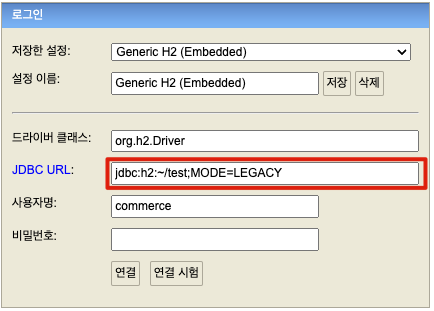
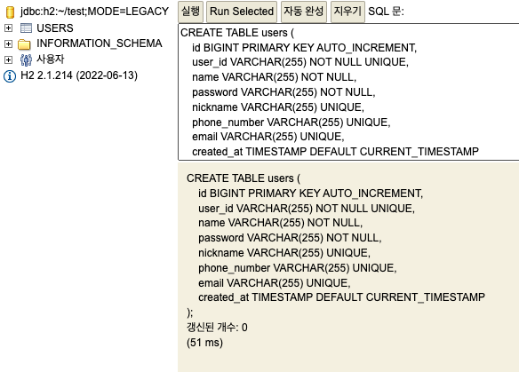

## 0. 요구 사항
- jdk-1.8 (Java8)
- h2-2.1.214
- git
- 해당 문서는 **macOS** 환경을 기준으로 작성됐습니다.


## 1. 실행 방법

### 1.1 프로젝트 다운로드

```bash
git clone https://github.com/David-Lee-dev/the_commerce-toy-pjt.git

cd the_commerce-toy-pjt
```

### 1.2 h2 데이터 베이스 준비

```bash
unzip h2-2022-06-13.zip

sh h2/bin/h2.sh
```



- JDBC URL: ```jdbc:h2:~/test;MODE=LEGACY```
- 사용자명: ```commerce```

### 1.3 DDL 입력
```sql
CREATE TABLE users (
    id BIGINT PRIMARY KEY AUTO_INCREMENT,
    user_id VARCHAR(255) NOT NULL UNIQUE,
    name VARCHAR(255) NOT NULL,
    password VARCHAR(255) NOT NULL,
    nickname VARCHAR(255) UNIQUE,
    phone_number VARCHAR(255) UNIQUE,
    email VARCHAR(255) UNIQUE,
    created_at TIMESTAMP DEFAULT CURRENT_TIMESTAMP
);
```


>h2 데이터베이스는 실행된 상태로 유지되어야 합니다.

### 1.4 빌드 및 실행

```bash
./gradlew clean build

java -jar build/libs/user-0.0.1-SNAPSHOT.jar
```

## 2. Open api(swagger UI) 접속 주소

http://localhost:8080/swagger-ui/index.html#/
